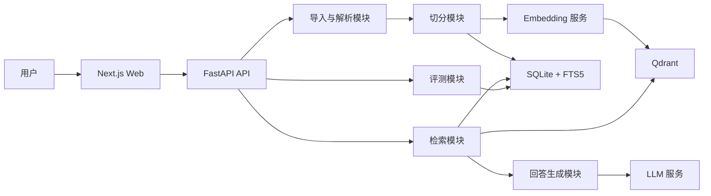

# AI-Engineer-RAG 技术架构（MVP v0.1）

## 1. 架构目标

本项目采用“模块化单体 + 轻量基础设施”的架构：业务 API、RAG 流水线和评测模块先在一个 FastAPI 服务中实现；SQLite 以本地文件形式保存业务数据，Qdrant 通过 Docker Compose 独立运行。

这样做能让第一版快速完成，又能清晰展示真实 RAG 系统的核心边界。后续遇到异步导入、并发或定时更新等需求，再把导入任务拆成 Worker，不提前引入 Celery、消息队列等复杂度。

## 2. 技术选型

| 层级 | MVP 选择 | 选择原因 |
| --- | --- | --- |
| Web | Next.js + TypeScript | 适合做问答、检索结果与引用展示 |
| API | FastAPI + Python 3.12 | Python 的 RAG 生态成熟，接口与数据校验开发效率高 |
| 关系数据 | SQLite + FTS5 | 本地文件、零服务依赖；保存文档、chunk 元数据、评测与查询记录，并提供关键词检索 |
| 向量数据库 | Qdrant | 过滤能力清晰，适合单独展示向量检索工程实践 |
| 关键词检索 | SQLite FTS5 | 无需额外服务；可与向量检索组成混合检索 |
| ORM / 迁移 | SQLAlchemy + Alembic | 数据模型与迁移可维护、可复现 |
| Embedding | 可配置的 OpenAI-compatible API | 通过环境变量切换模型供应商，避免代码绑定单一厂商 |
| LLM | 可配置的 OpenAI-compatible API | 用于回答生成、后续 query rewrite / rerank |
| HTTP 抓取 | httpx + BeautifulSoup | 支持单页 URL 正文提取，范围可控 |
| 测试 | pytest | 覆盖纯函数、API 与核心检索逻辑 |
| 本地编排 | Docker Compose | 一条命令启动 Qdrant；SQLite 作为本地文件由 API 使用 |

## 3. 系统全景



## 4. 两条核心数据流

### 4.1 导入与索引

```text
Markdown 文件 / 公开 URL
  -> 导入 API
  -> 提取、清洗、规范化为 Markdown
  -> 创建 Document
  -> 按标题与长度切分为 DocumentChunk
  -> 写入 SQLite（内容、元数据、FTS5 全文检索索引）
  -> 调用 Embedding 模型
  -> 写入 Qdrant（向量 + chunk_id + 可过滤元数据）
  -> 返回导入和索引状态
```

### 4.2 检索与问答

```text
用户问题 + 检索模式 + 可选过滤条件
  -> 向量召回（Qdrant）和/或关键词召回（SQLite FTS5）
  -> 使用 RRF 融合结果
  -> 可选 rerank（第二阶段迭代）
  -> 获取完整 chunk 和来源信息
  -> 构造带引用编号的上下文
  -> LLM 仅依据上下文生成答案
  -> 校验和格式化引用
  -> 返回答案、引用、候选片段和耗时
```

## 5. 模块边界

```text
apps/
  api/                 # FastAPI 路由、配置、依赖注入、数据库迁移
  web/                 # Next.js 界面

packages/
  ingestion/           # Markdown/URL 导入、内容提取、去重
  chunking/            # 文档结构识别与 chunk 策略
  indexing/            # embedding、Qdrant 写入、重建索引
  retrieval/           # 向量、全文、RRF 融合、过滤与 rerank
  generation/          # Prompt、上下文组装、回答和引用格式化
  evaluation/          # 读取评测集、运行实验、统计指标
  shared/              # Pydantic 模型、通用类型、配置接口
```

原则：模块之间传递领域对象和接口，不在路由层直接写 Qdrant 查询或 Prompt。这样后续替换模型、检索算法或存储实现时，影响范围可控。

## 6. 存储设计

### SQLite：`data/ai_engineer_rag.db`

| 表 | 核心字段 | 说明 |
| --- | --- | --- |
| `collections` | `id`, `name`, `description` | 知识库集合，MVP 默认提供一个集合 |
| `documents` | `id`, `collection_id`, `title`, `source_url`, `source_type`, `content_hash`, `raw_content`, `status` | 原始文档与导入状态 |
| `document_chunks` | `id`, `document_id`, `section_path`, `content`, `position`, `token_count` | 可追踪的检索单元 |
| `document_chunks_fts` | `content`, `chunk_id` | FTS5 虚拟表，用于关键词检索 |
| `query_logs` | `id`, `query`, `mode`, `filters`, `answer`, `latency_ms` | 问答调试与观测 |
| `query_retrievals` | `query_log_id`, `chunk_id`, `rank`, `score`, `stage` | 一次请求的召回明细 |
| `eval_questions` | `id`, `question`, `expected_chunk_ids`, `reference_answer`, `tags` | 评测问题 |
| `eval_runs` | `id`, `config`, `metrics`, `started_at`, `finished_at` | 可复现实验结果 |

### Qdrant collection：`document_chunks`

- `id`：与 SQLite 的 `document_chunks.id` 相同。
- `vector`：chunk 内容的 embedding。
- payload：`collection_id`、`document_id`、`source_type`、`tags`。
- Qdrant 只承担向量召回和元数据过滤；chunk 原文以 SQLite 为唯一事实来源，避免双写不一致。

## 7. 检索策略设计

### MVP 必做策略

| 模式 | 执行方式 |
| --- | --- |
| `vector` | 将 query embedding 后在 Qdrant 搜索 top-k |
| `keyword` | 使用 SQLite FTS5 查询 `document_chunks_fts` |
| `hybrid` | 并行执行 vector 和 keyword，用 Reciprocal Rank Fusion（RRF）合并 |

默认模式为 `hybrid`。首次版本不必实现复杂 query rewrite，优先用评测数据验证三种基础策略的差异。

### Rerank 的迭代位置

在 Sprint 4 增加可插拔的 `Reranker` 接口：先从混合检索中召回 20 个候选，再选出前 5 个作为生成上下文。评测中将“是否 rerank”作为一个配置维度，不能只展示主观效果。

## 8. 回答与引用约束

生成模块输入的上下文使用稳定编号，例如 `[S1]`、`[S2]`。Prompt 要求：

1. 仅依据给定来源回答事实性问题。
2. 关键结论后使用来源编号引用。
3. 信息不足时明确说明证据不足。
4. 不生成不存在的链接、文档标题或来源编号。

API 在模型输出后检查引用编号是否属于本次上下文。无效编号将被移除并记录日志；正式版本可进一步使用结构化输出约束。

## 9. API 形态

```text
POST /api/v1/documents/markdown  导入 Markdown
POST /api/v1/documents/url       导入 URL
GET  /api/v1/documents           查看资料及状态
POST /api/v1/collections/{id}/index  重建索引
POST /api/v1/search              仅检索
POST /api/v1/qa                  检索 + 生成 + 引用
POST /api/v1/evaluations/runs    运行评测
GET  /api/v1/evaluations/runs/{id} 获取评测结果
GET  /health                     健康检查
```

先完成 `documents/markdown`、`search`、`qa` 和 `health`；URL 导入、评测 API 在主路径稳定后补齐。

## 10. 环境变量

```dotenv
DATABASE_URL=sqlite:///./data/ai_engineer_rag.db
QDRANT_URL=http://qdrant:6333
LLM_BASE_URL=https://api.openai.com/v1
LLM_API_KEY=replace_me
LLM_MODEL=replace_me
EMBEDDING_MODEL=replace_me
```

本地开发中不得将真实密钥写入 `.env.example` 或 Git 仓库。

## 11. 开发顺序

1. 初始化后端、SQLite、Qdrant 和基础健康检查。
2. 定义 `Document` / `DocumentChunk` 数据模型并完成迁移。
3. 做 Markdown 导入、切分和可视化检查 chunk。
4. 接入 embedding 与 Qdrant，完成纯向量检索。
5. 增加 SQLite FTS5 与 hybrid RRF。
6. 增加引用约束的问答生成。
7. 建立评测集，比较策略并记录指标。
8. 最后做 Web 页面、Docker 打包与 Demo。

## 12. 本阶段决策记录

- 不使用 LangChain 作为项目主骨架：核心检索、融合与引用逻辑自行封装，更容易在作品集中讲清工程细节。
- 不在 MVP 引入消息队列：导入量较小，先以同步任务实现闭环；接口保留任务化扩展空间。
- 不使用 pgvector：选择 Qdrant 用于展示专用向量数据库、过滤和检索能力；SQLite 保持业务数据、日志和全文检索职责。
- MVP 不引入 Elasticsearch：SQLite FTS5 足够完成关键词检索和混合检索闭环；Elasticsearch 可作为后续企业级检索后端的对比实验。
- 先用外部模型 API：降低本地硬件门槛；Provider 通过配置抽象，日后可替换成本地模型。
